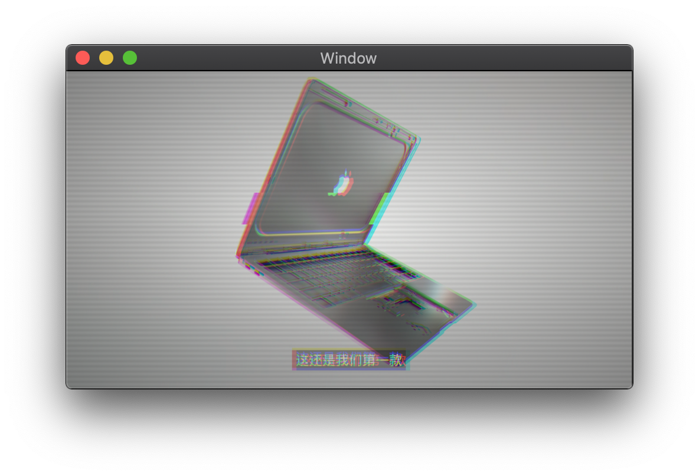
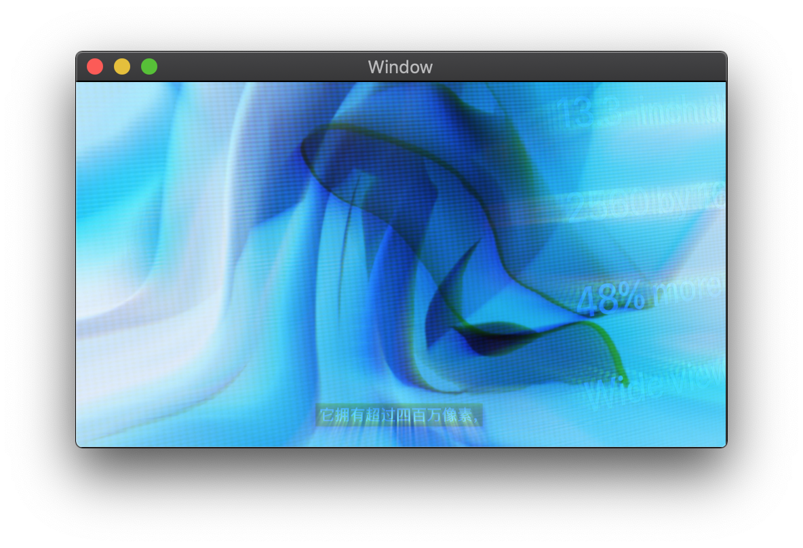
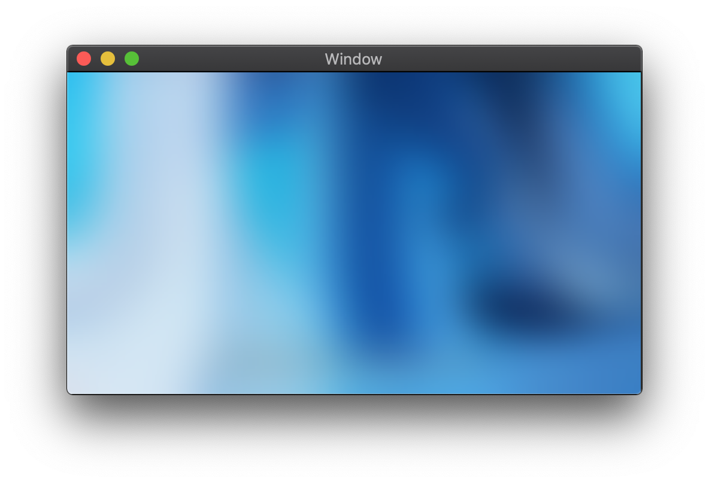

# MetalPlay

> This is a WIP project.

A sample project to demonstrate how to play videos with filters using Metal and AVFoundation.

## Built-in Filters

* Glitch Effect:


* Dream Effect:


* Gaussian Blur:


## Usage Guide

Modify `PlayerViewController.swift` file and replace the placeholder with your video URL:

```swift
self.player = AVPlayer(url: URL(string: "<#Your video URL here#>")!)
```

## TODOs

- [ ] Playback control
- [ ] Run time shaders selection
- [ ] ...

## License

The Unlicense